#  Project #3: **[Gift Loop](https://giftloop.herokuapp.com/)**

## Description

We want Singapore to be a society where people volunteer for social causes and help one another out in times of need. Instead of money, we decide to use a digital currency called time credits. Organisations start out with 1,000 time credits and can create requests to get volunteers for social causes, but will also have to give back by offering rewards like art classes. Individuals start out with 0 credit and will build up their credits by first volunteering for organisational events or helping other individuals out.

* Users can see their profile page, fulfill requests and redeem rewards

* Event requesters can see the attendance list and send sms reminders to attendees

## ERD

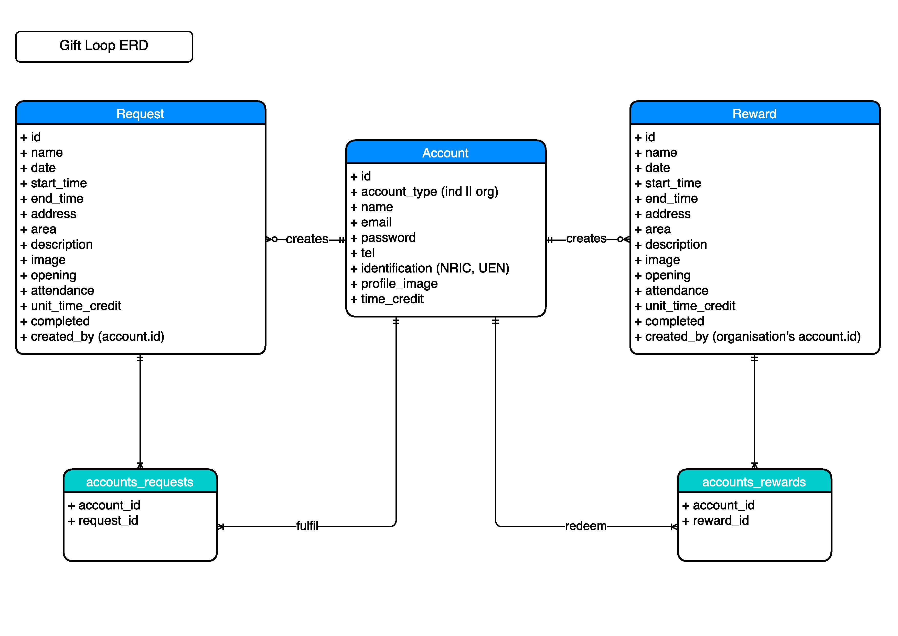

## Wireframes

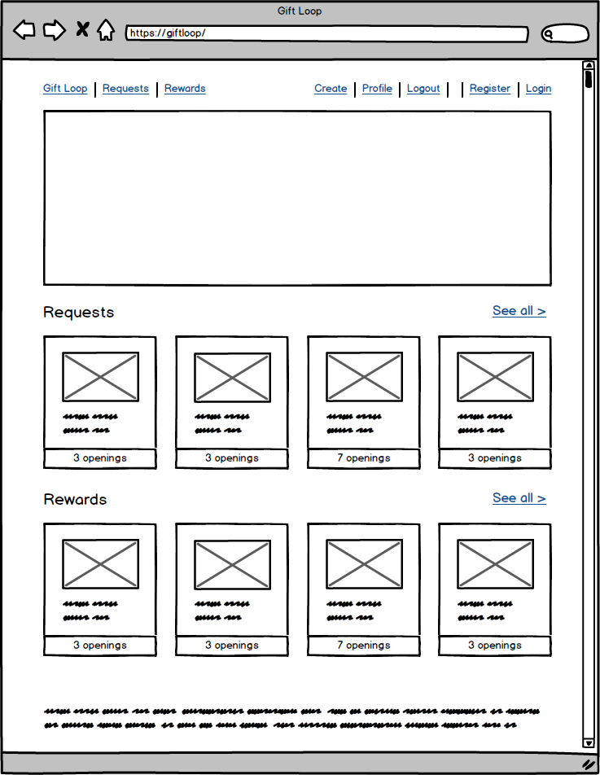
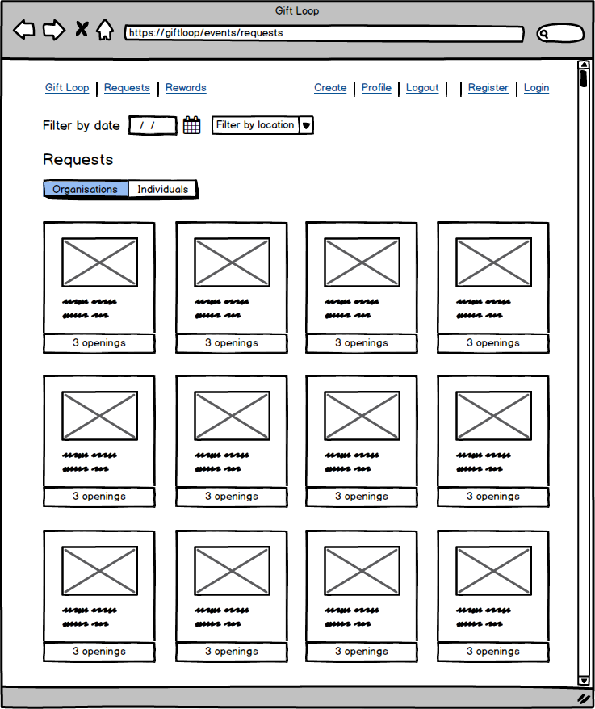
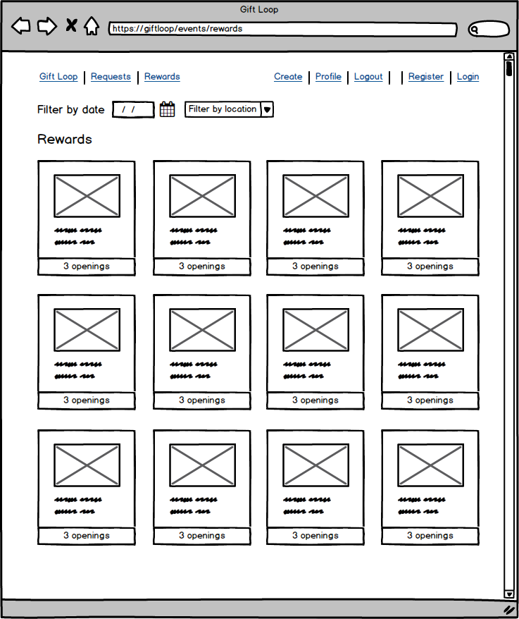
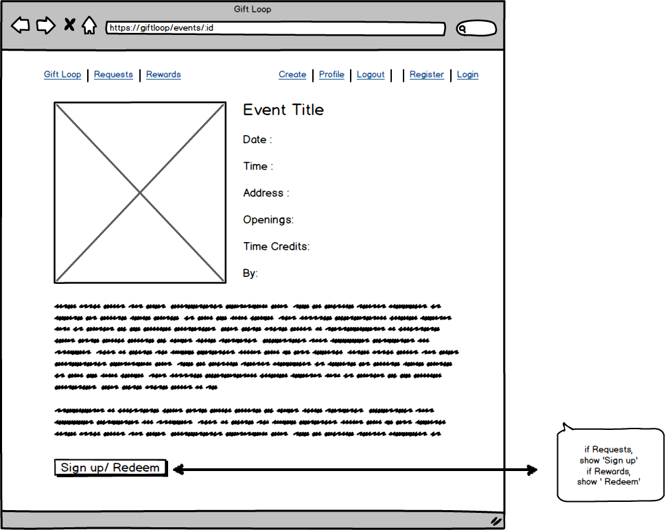
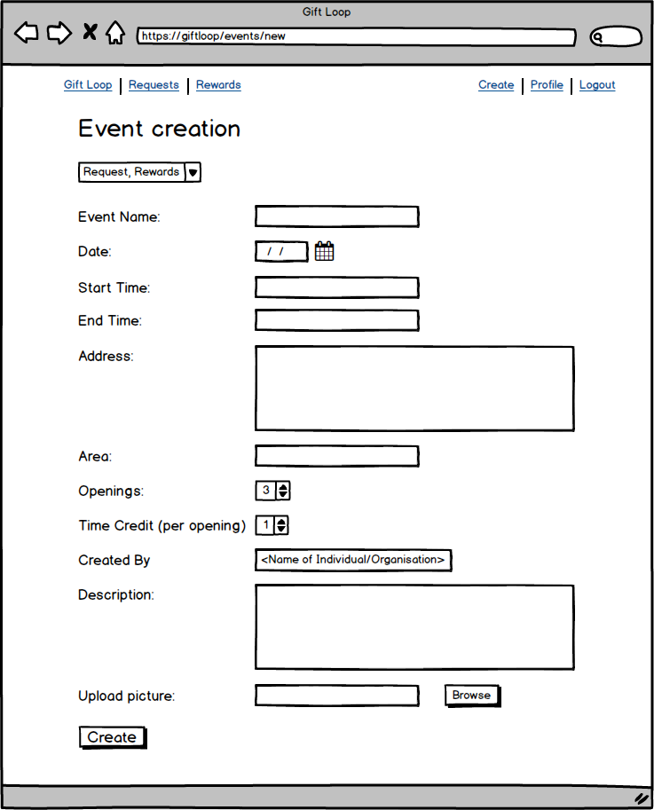
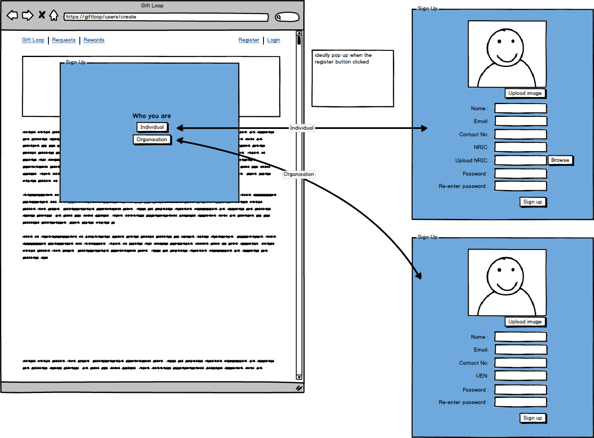
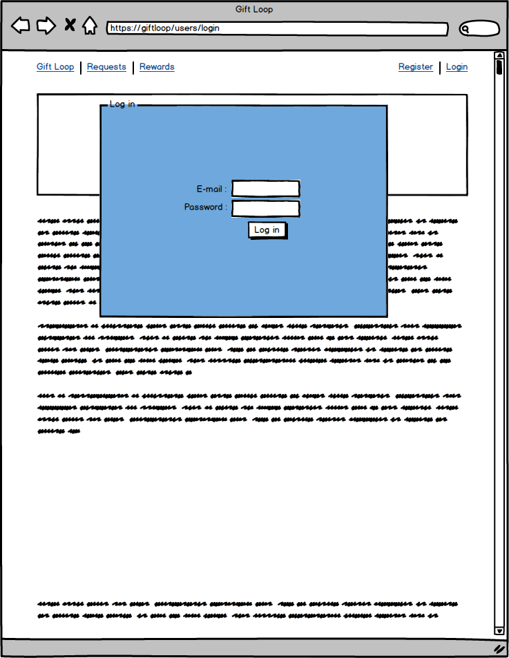
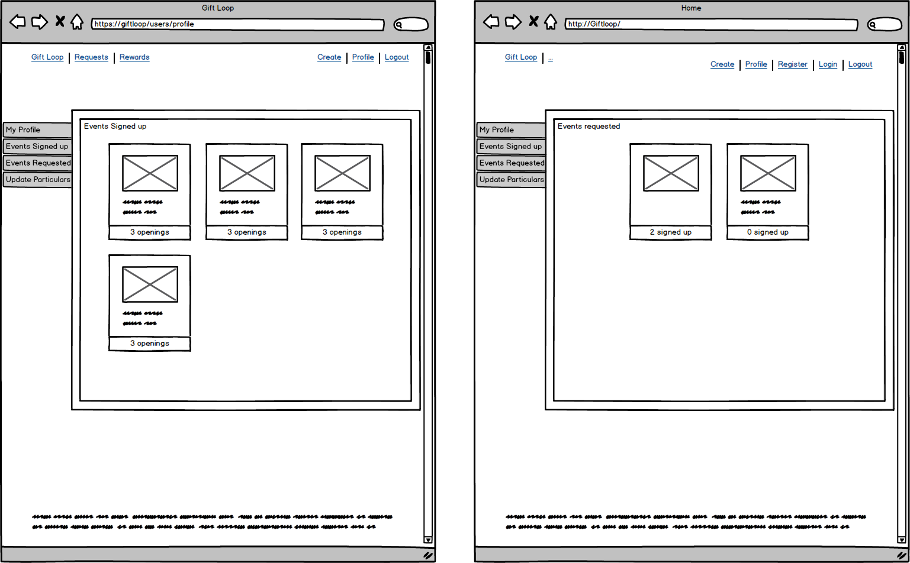
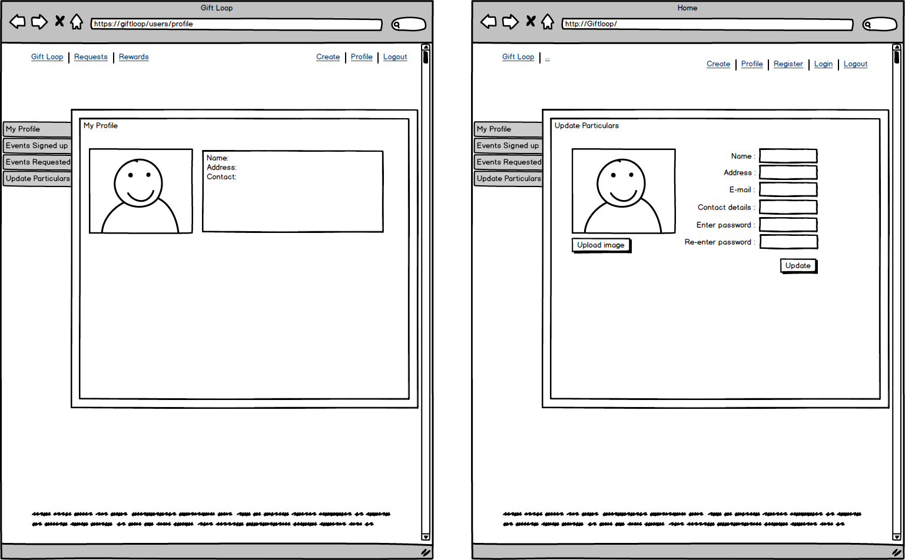
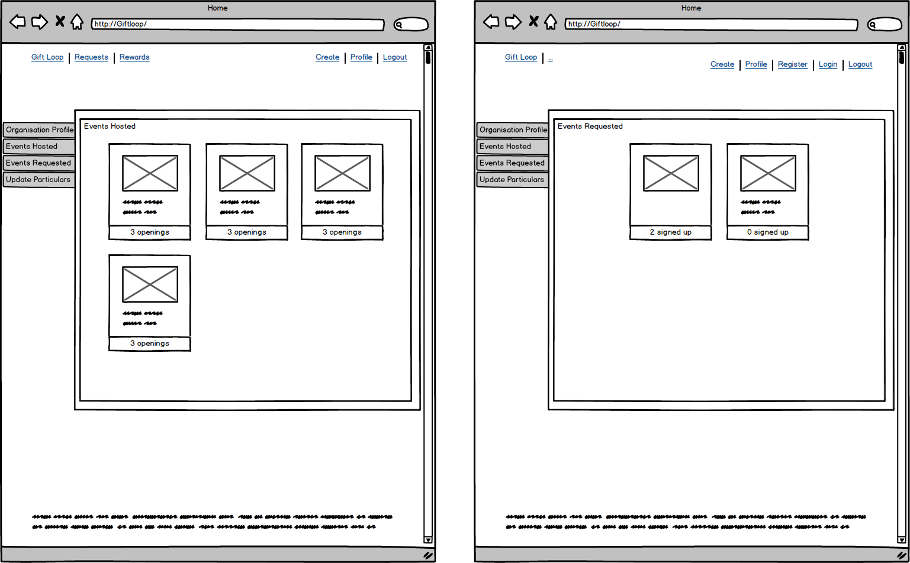
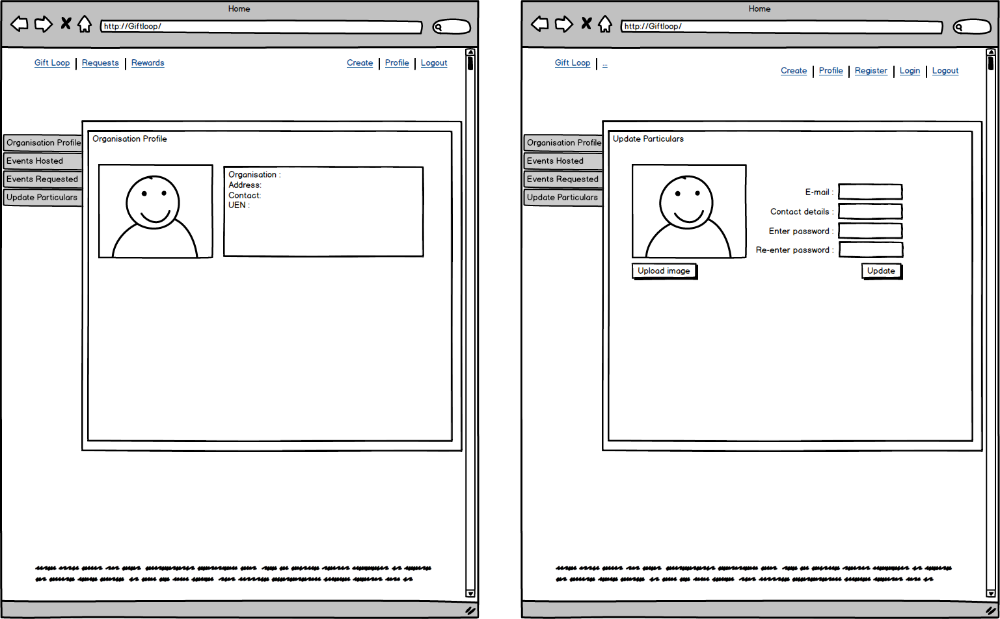

## Authors

* **Nawas** - *Team Leader* - [king-of-flab](https://github.com/king-of-flab)
* **Daniel** - *Git Master* - [ddanielnp](https://github.com/ddanielnp)
* **Jocelyn** - [dreamz89](https://github.com/dreamz89)
* **Shumin** - [shumin13](https://github.com/shumin13)

## Acknowledgments

* Icons in the main page from [Icons8](http://www.icons8.com)
* Curly Loop by Prosymbols from [The Noun Project](https://thenounproject.com)
* Arrow by Ersin from [The Noun Project](https://thenounproject.com)
* Blue watercolor background [Designed by Freepik](http://www.freepik.com/free-vector/soft-background-with-a-cute-blue-watercolor-stain_1064674.htm)

## Built With
* [Ruby on Rails](http://rubyonrails.org/)
* [PostgreSQL](https://www.postgresql.org/)
* [Twilio API](http://www.twilio.com)
* [Cloudinary API](http://www.cloudinary.com) with help from Cloudinary support staff Yakir Perlin
* [Materialize CSS Framework](http://materializecss.com/)
